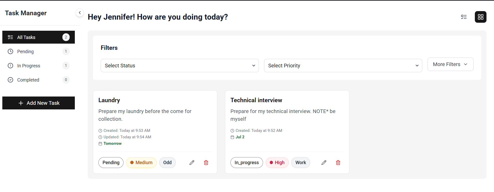

# Full-Stack Technical Assessment

### Task Management Interface


## Overview
Build a simple **Task Management System** with user authentication and CRUD operations. This test evaluates your skills in modern web development using Node.js, Express, TypeScript, PostgreSQL, and React.

**Time Allocation:** 4-6 hours

## Technical Requirements

### Backend Stack
- **Node.js** (v20+)
- **Express.js** (v4+)
- **TypeScript** (v5+)
- **PostgreSQL** (v15+)
- **JWT** for authentication
- **bcrypt** for password hashing

### Frontend Stack
- **React** (v18+)
- **TypeScript**
- **Modern CSS** (CSS Modules, Styled Components, or Tailwind)
- **Fetch API** or Axios for HTTP requests

## Backend Requirements

### Database Schema
Create the following PostgreSQL tables:

```sql
-- Users table
CREATE TABLE users (
  id SERIAL PRIMARY KEY,
  email VARCHAR(255) UNIQUE NOT NULL,
  password VARCHAR(255) NOT NULL,
  name VARCHAR(255) NOT NULL,
  created_at TIMESTAMP DEFAULT CURRENT_TIMESTAMP
);

-- Tasks table
CREATE TABLE tasks (
  id SERIAL PRIMARY KEY,
  title VARCHAR(255) NOT NULL,
  description TEXT,
  status VARCHAR(50) DEFAULT 'pending',
  priority VARCHAR(20) DEFAULT 'medium',
  user_id INTEGER REFERENCES users(id) ON DELETE CASCADE,
  created_at TIMESTAMP DEFAULT CURRENT_TIMESTAMP,
  updated_at TIMESTAMP DEFAULT CURRENT_TIMESTAMP
);
```

### API Endpoints

#### Authentication
- `POST /api/auth/register` - User registration
- `POST /api/auth/login` - User login
- `GET /api/auth/profile` - Get current user profile (protected)

#### Tasks
- `GET /api/tasks` - Get user's tasks (protected)
- `POST /api/tasks` - Create new task (protected)
- `PUT /api/tasks/:id` - Update task (protected)
- `DELETE /api/tasks/:id` - Delete task (protected)

### TypeScript Interfaces

Create proper TypeScript interfaces for:
- User model
- Task model
- API request/response types
- JWT payload

### Middleware Requirements
- Authentication middleware using JWT
- Request validation middleware
- Error handling middleware
- CORS configuration

## Frontend Requirements

### Pages/Components
1. **Login/Register Page**
   - Toggle between login and register forms
   - Form validation
   - Error handling

2. **Dashboard**
   - Display user's tasks in a list/grid
   - Filter tasks by status (pending, in-progress, completed)
   - Sort tasks by priority or date

3. **Task Form**
   - Create/Edit task modal or separate page
   - Fields: title, description, status, priority
   - Form validation

### State Management
- Use React hooks (useState, useEffect, useContext)
- Implement authentication state management
- Handle loading and error states

### Styling Requirements
- Responsive design (mobile-friendly)
- Clean, modern UI
- Loading indicators
- Success/error notifications

## Deliverables

### Code Structure
```
project/
├── backend/
│   ├── src/
│   │   ├── controllers/
│   │   ├── middleware/
│   │   ├── models/
│   │   ├── routes/
│   │   ├── types/
│   │   ├── utils/
│   │   └── server.ts
│   ├── package.json
│   └── tsconfig.json
├── frontend/
│   ├── src/
│   │   ├── components/
│   │   ├── pages/
│   │   ├── hooks/
│   │   ├── types/
│   │   └── App.tsx
│   ├── package.json
│   └── tsconfig.json
└── README.md
```

### Documentation
Provide a comprehensive README.md with:
- Setup instructions
- Environment variables needed
- Database setup commands
- How to run the application
- API documentation
- Any assumptions made

## Evaluation Criteria

### Code Quality (30%)
- Clean, readable TypeScript code
- Proper error handling
- Code organization and structure
- Consistent naming conventions

### Functionality (25%)
- All required features working
- Proper authentication flow
- CRUD operations functioning
- Data validation

### Database Design (15%)
- Proper schema design
- Database queries optimization
- Data relationships

### Security (15%)
- JWT implementation
- Password hashing
- Input validation
- SQL injection prevention

### Frontend Implementation (15%)
- Component structure
- State management
- User experience
- Responsive design

## Bonus Points

### Advanced Features (+10 points each)
- [ ] Implement task due dates with reminders
- [ ] Add task categories/tags
- [ ] Implement real-time updates using WebSockets
- [ ] Add unit tests (Jest/Vitest)
- [ ] Deploy to cloud platform (Heroku, Vercel, etc.)
- [ ] Implement pagination for tasks
- [ ] Add dark/light theme toggle

### Code Quality Enhancements (+5 points each)
- [ ] ESLint and Prettier configuration
- [ ] Proper TypeScript strict mode
- [ ] Environment-based configuration
- [ ] API rate limiting
- [ ] Request logging middleware

## Sample Data
After setup, create sample data:
- 2-3 test users
- 10-15 tasks with different statuses and priorities

## Submission Guidelines

1. **AI Usage**
   - We discourage using AI Code tools extensively, however using it to learn or for help with an understanding is allowed.
   - We require that you are not dependent on AI Coding tools, and are able to work without AI Coding tools.

2. **Code Repository**
   - Push code to GitHub/GitLab
   - Include all source files
   - Exclude node_modules and .env files

3. **Documentation**
   - Complete README with setup instructions
   - Document any design decisions
   - List any known issues or limitations

4. **Environment Setup**
   - Provide .env.example files
   - Include database migration scripts
   - Docker configuration (bonus)

## Questions?
If you have questions about requirements or need clarification on any aspect of the test, please ask. We value communication and problem-solving approach as much as the final implementation.

Good luck!